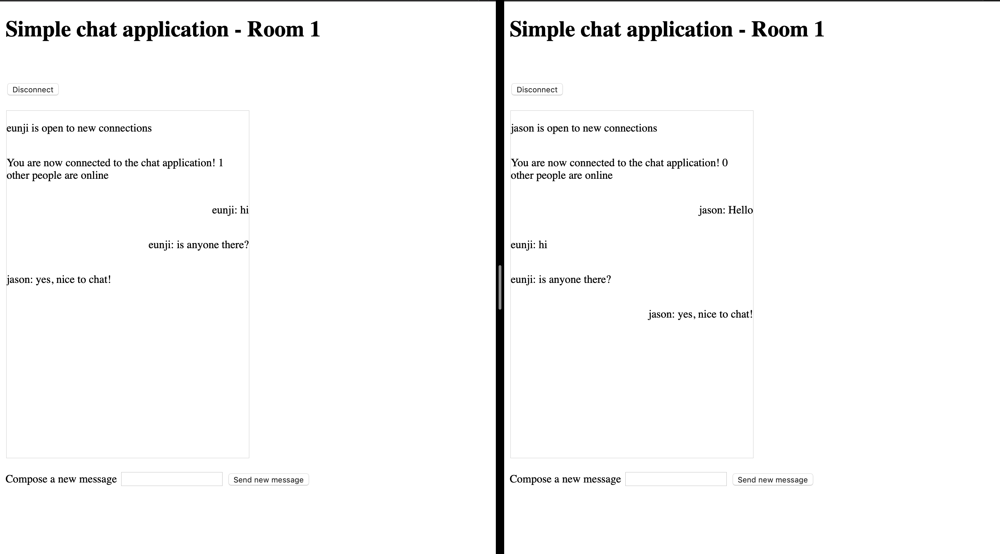

# express-websocket

This is a simple chat application that uses Express.js component as websocket on server side. When used on local host, keep line 36 of client.html. If using serverless host, change line 36 to subdomain of the apigateway.

